# SeedSigner Translations
The translations we have in SeedSigner are a 100% volunteer-driven process. AI auto-translations are NOT an option for us.

If you want your language included in SeedSigner, it's up to you to volunteer to do it (or recruit translators) and be a manager of sorts to execute all the steps below.

We want as many languages as possible in SeedSigner and are so grateful for every translator who volunteers to make this happen!

## Translators' telegram group
First, make sure you join our [translators' telegram group](https://t.me/seedsigner_translators).

This is where we coordinate efforts, answer translators' questions, etc.

## Get started on Transifex
Create a free account at [transifex.com](https://transifex.com)

Join our translation project: [https://explore.transifex.com/seedsigner/seedsigner](https://explore.transifex.com/seedsigner/seedsigner)

When it prompts you to select a language, note a few things:

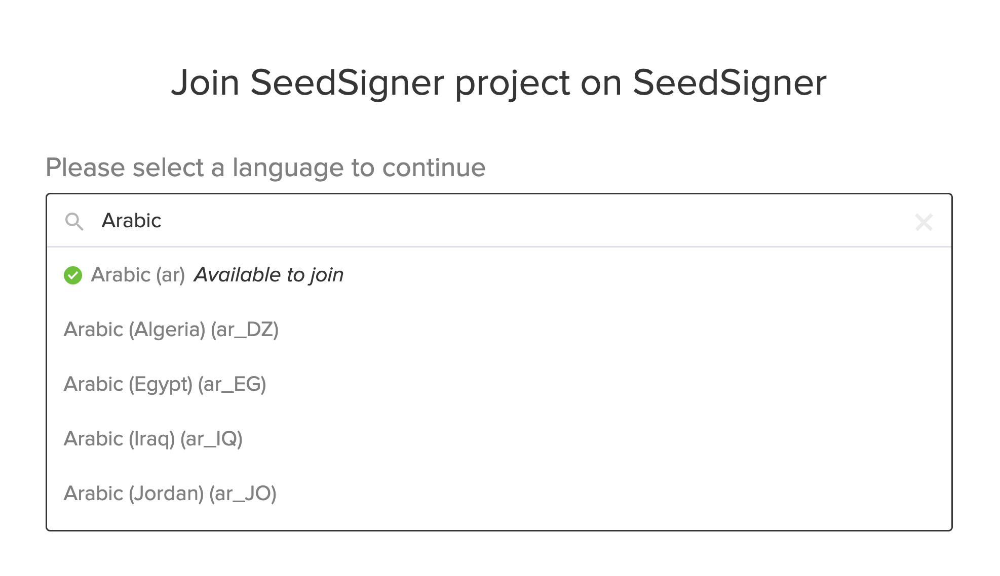

* Official language codes include the language AND a specific country (e.g. ar_EG = Arabic as spoken in Egypt).

* Transifex considers each entry in this list as a SEPARATE translation effort (e.g. the translations for ar_DZ do not get copied over to ar_EG, ar_IQ, etc).

* But in MOST cases, we do NOT want to be that specific; we assume that Spanish as spoken in Mexico (es_MX) is close enough to Spanish as spoken in El Salvador (es_SV).

* So always select the base language entry with NO country code.
  * ✅ es
  * ✅ ar
  * ❌ es_MX
  * ❌ ar_EG

* And often the language you're looking for has already been added to our project ("Available to translate" in the screenshot above) so just select that.

* Only in rare exceptions do we opt for the full language + country code entry (pt_BR = Portuguese as spoken in Brazil which is distinct from pt_PR = Portuguese as spoken in Portugal) or for important variants (zh-Hans = Simplified Chinese, zh-Hant = Traditional Chinese).
  * If you think your translation effort requires this level of specificity beyond the base language entry ("X as spoken in country A is totally different than X as spoken in country B!"), reach out to us in the translators' telegram group to discuss.

## Wait for approval
An admin has to approve your request to add a language or join an existing language team.

If you receive a rejection notice, it's either:
* You selected the wrong language code above (e.g. you asked for "es_MX" but we already have "es" in progress).
* Or we have established translators for that language and want to avoid a "too many cooks in the kitchen" problem.

---

## Style guide
### Capitalization:
* Titles use "title case". Follow the capitalization used for book title in your language.
  * In English: "A Call to Arms", "For Whom the Bell Tolls", etc.
* Buttons use "sentence case".
  * In English: Only the first letter of a sentence is capitalized ("Sign transaction"), though also certain proper nouns ("Export as SeedQR").

### Body text:
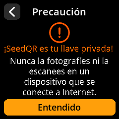

* Must completely fit in the screenshots; body text does not scroll.
* Should ALWAYS end with whatever end punctuation your language uses. If end punctuation is omitted, it can look like there might be more text to read but it isn't displayed.

---

## Slightly technical translation notes

### Variable insertion via "{}"
Many strings will include empty curly braces: `Dice Roll {}/{}`

In the SeedSigner code, those curly braces will be replaced with dynamic values. But there's no way for the translator to know what those values will actually be ahead of time. A simple example for a website: `"Welcome back, {}"`. The code will insert the user's first name. The translator's job is to translate the greeting but they MUST preserve the variable insertion in their translated string!

For example:
* `"Buenas días, {}"` -> "Buenas días, Carlos"
* But if the translator forgets the curly braces: `"Buenas días"` -> "Buenas días"
  * And in reality this translation would throw an error when the screen is rendered because the code will still try to inject the name, but there's no `{}` specified to receive it.

In such cases, Transifex will show a "Developer Notes" field which provides explanatory context for what will be inserted into the curly braces:

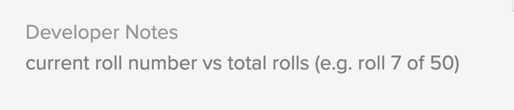

This way you can anticipate what kind of info will be put into those variables.

### Variable insertion via named variables
In more complex strings, we provide named variables so that translators can position each one exactly as needed.

For example:
* `"{denomination_symbol}{amount} fee"` -> "$5 fee"
* But perhaps your locale's custom reverses this:
  * `"{amount}{denomination_symbol} frais"` -> "10€ frais"

When named variables are in the source string, they MUST be included in the translation string.

And the variable names used MUST exactly match:
* For `"{denomination_symbol}{amount} fee"`:
  * ✅ `"{amount}{denomination_symbol} frais"`
  * ❌ `"{amount}{denomnation_symbol} frais"`

---

## When translations are complete
Now we have to download the translations from Transifex and submit them to our translations repository (aka "repo") in github.

### Github
Create an account on github.com if you haven't already.

### Finish translation changes, download .po file
* Update and review translations in Transifex.
* Navigate to this screen in Transifex and click "Download for use":

  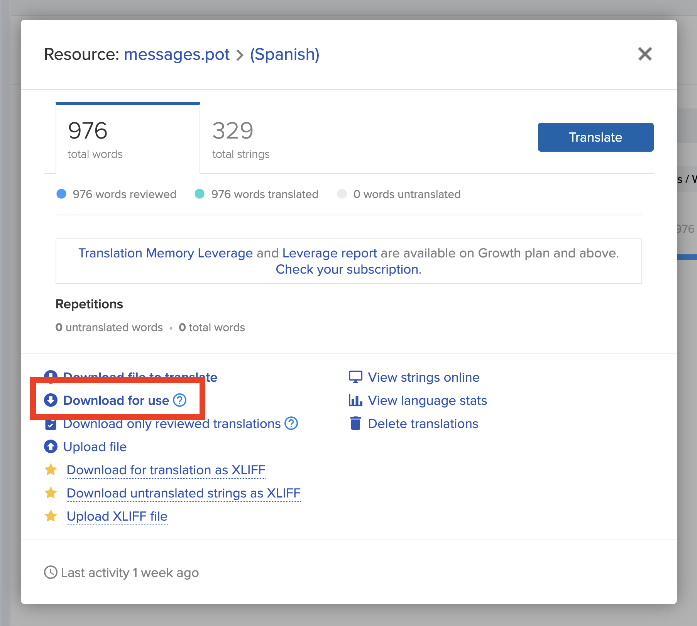

* IMPORTANT: Rename the downloaded file to: `messages.po`

---

### Fork the `seedsigner-translations` repo
(skip this step if you've already forked it)

In order to submit a change, you'll need your own copy of the `seedsigner-translations` repo. Make sure you're signed in to your github account and then:
* Go to the [translations repo](https://github.com/SeedSigner/seedsigner-translations)
* Click "fork" at the top right.

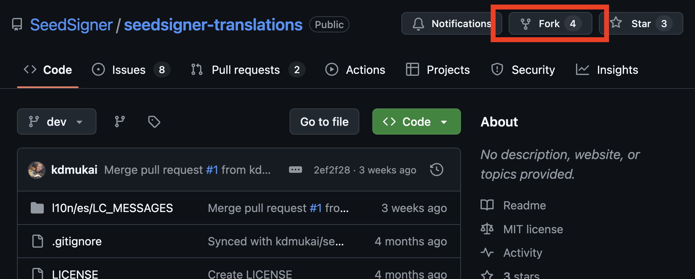 

Leave all the defaults as they are and proceed with creating the fork.

---

### Upload your changes to your fork
Your browser url should now be: github.com/<your_username>/seedsigner-translations

Click into the `l10n` folder.

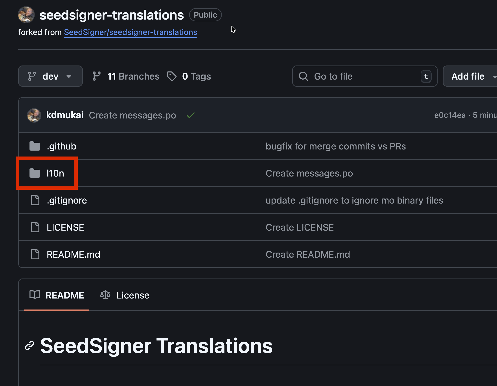

You'll need to create a folder for your language's language code (e.g. "es" for Spanish, "pt_BR" for Brazilian Portuguese, etc.). If the folder already exists, skip to the "Update the messsages.po" section.

The only way to add the folder structure in this web UI is a little awkward: we'll create the required folders and an empty placeholder file. Click "Add file" and "Create new file".

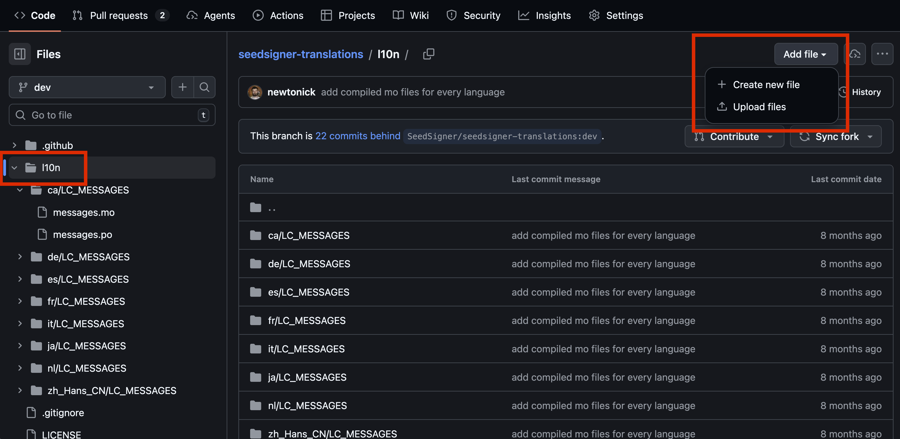

At the top there's an area to type a name for the file. But it'll also accept the name of any folders we want to create along the way. Begin by typing the language code for your language.

In this example the language code is "xx":

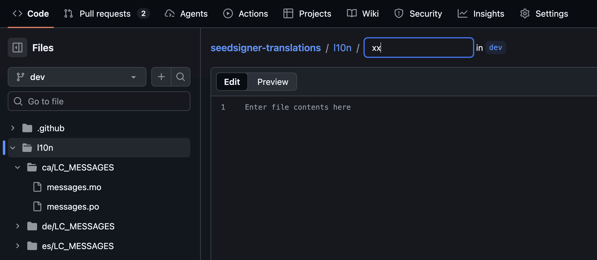

As soon as you add a "/" after the language code, it will change the display to show that it'll be treated as a new folder:

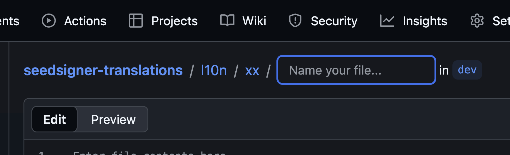

Continue typing to add a folder called "LC_MESSAGES" and another "/" at the end. Then name the new file "messages.po":

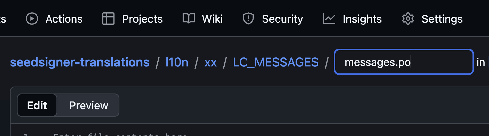

Leave the file empty for now and just click "Commit changes...".

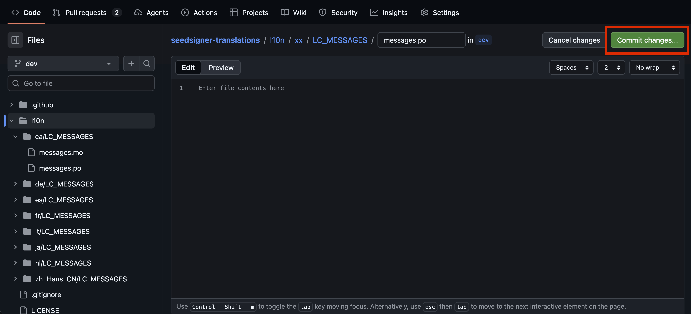

Accept the defaults and commit.

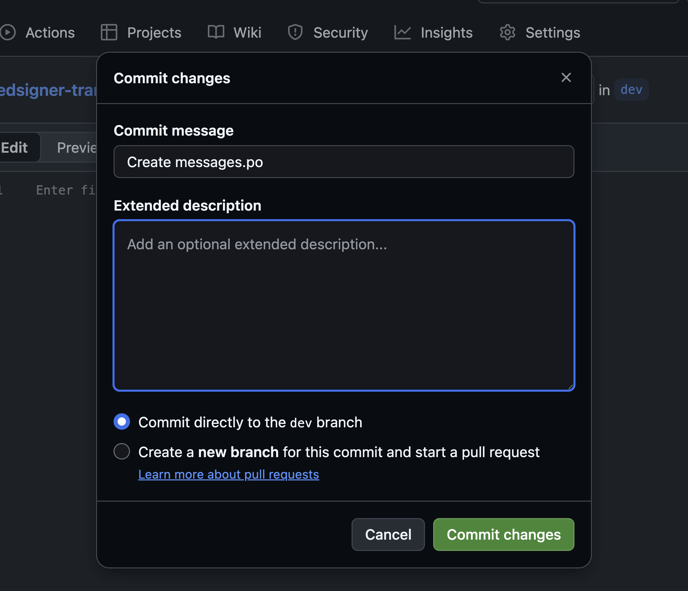

#### Update the `messages.po`
Make sure you are in your language's "l10n/<language_code>/LC_MESSAGES/" directory. In the upper right click "Add file" and choose "Upload files":

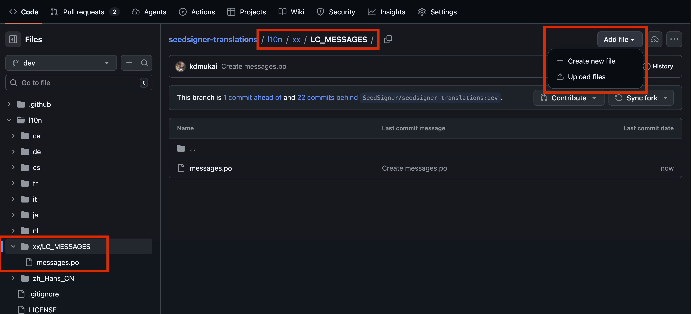

Verify that the following screen is listing the correct directory:

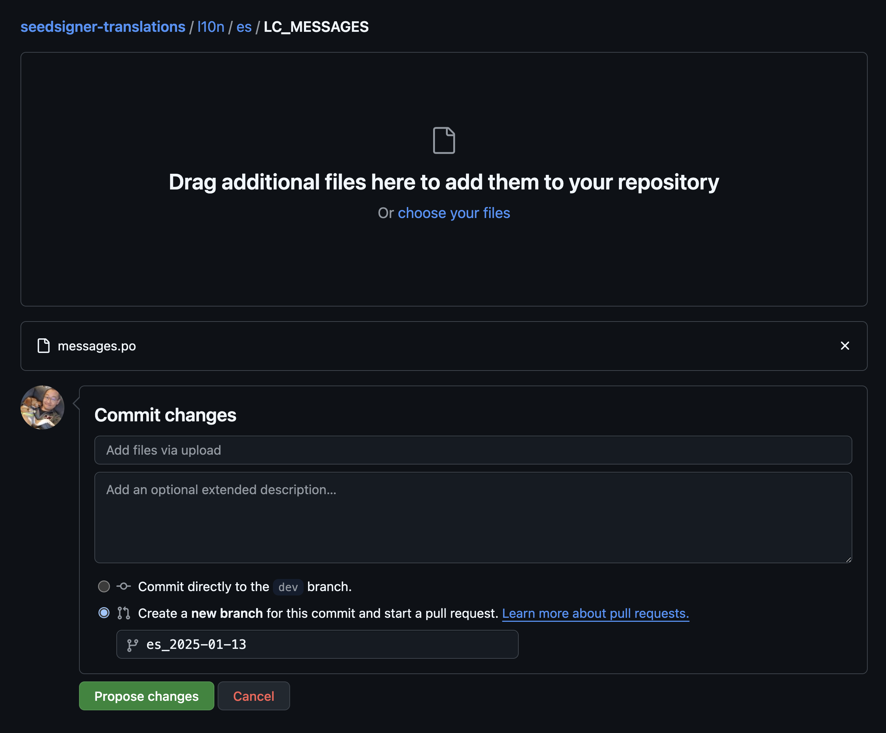

* Click to upload your `messages.po` file.
* Select "Create a new branch for this commit and start a pull request."
* Name your new branch with the language code and date: e.g. `es_2025-01-13`
* Click "Propose changes".

On the following screen we will finalize your Pull Request (PR):

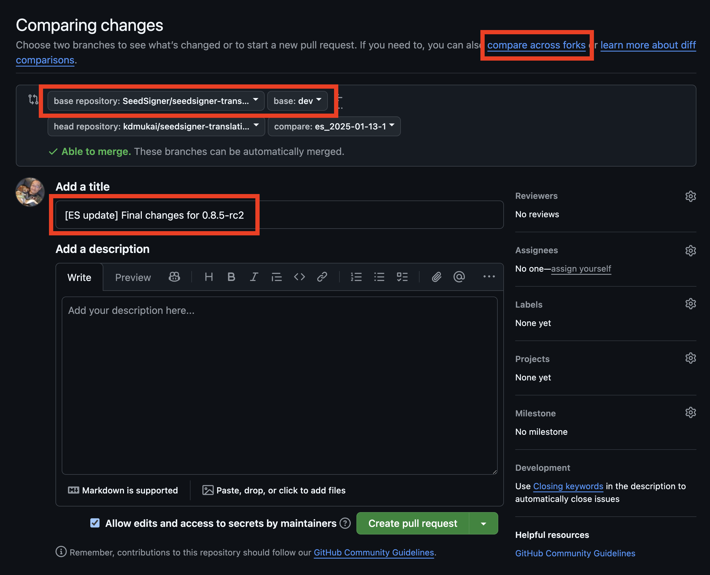

* Click on "compare across forks". That will alter the "base repository" droplist options.
* Select "SeedSigner/seedsigner-translations" as the "base repository".
  * Its "dev" branch should already automatically be selected.
* Add a title that includes the language code and (optional) additional context/info.
* Scroll down and review the diff at the bottom.
  * If you spot any translations issues, you can only fix them back in Transifex. After any issues are fixed, you'll have to download the `messages.po` file and repeat this process.
* Click "Create pull request" when you're ready.

---

## Review new/updated screenshots
Once your PR is created, github will automatically generate screenshots for your new translations. It is YOUR job to review the screenshots and be our first couple passes at quality control.

### Broken screens
Any time a translation represents a major "first" (e.g. first Asian language), the odds of rendering errors are MUCH higher. This in-progress translation is rendering poorly because it's our first right-to-left language:

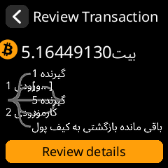

### Which text can run offscreen and which cannot?

Okay to run long:
* Titles
* Buttons

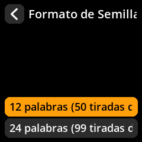

In this screenshot both the title and the active button will scroll the text back and forth into view. Better to avoid if possible, but totally acceptable if either require scrolling.

NOT okay to run long:
* Warning screen subheads
* Any other body content

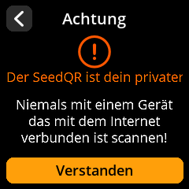

Notice that the red subheader text does not fit. These subheads do NOT currently autoscroll.

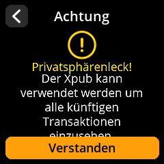

Any text that runs too long vertically and ends up offscreen or obscured by another screen element would need to be rewritten to be shorter. And remember that end punctuation is required.

---

## Accessing the auto-generated screenshots
Once your PR is created, you'll see the results of our automated checks:

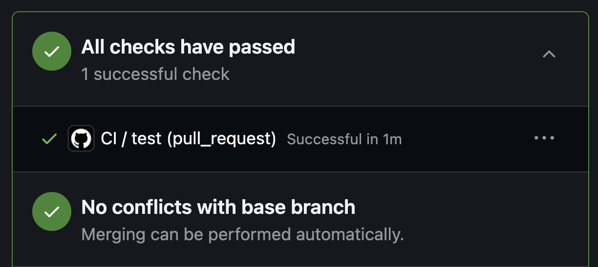

Click into "All checks have passed" to reveal the "CI / test (pull_request)" line. Click on that to view the details.

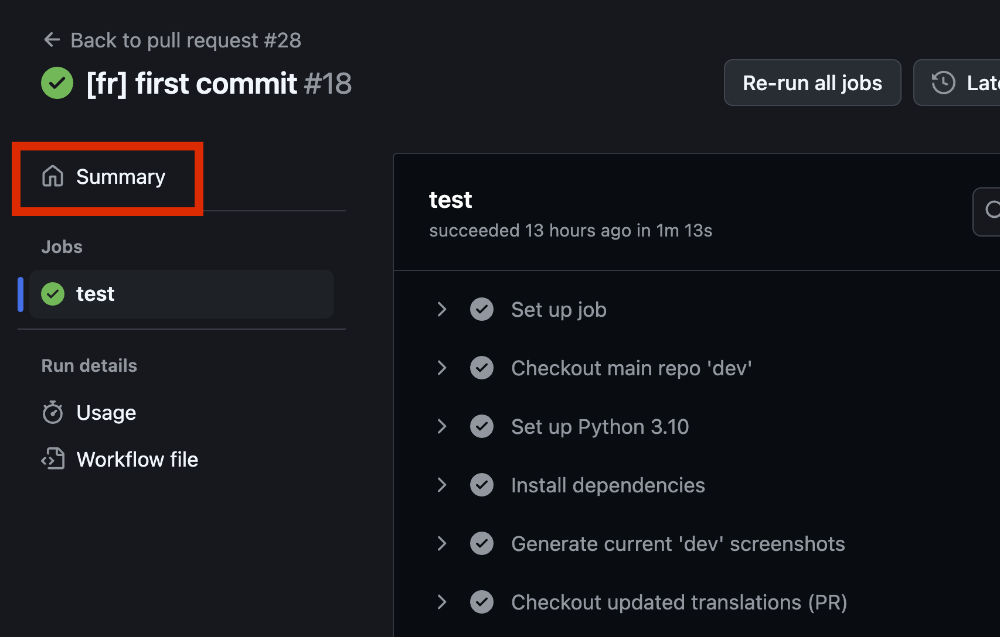

Click "Summary" and scroll down to the "Artifacts" section:

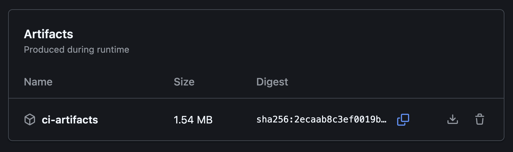

Click the download arrow to download a zip file of the results.

Inside you'll see:

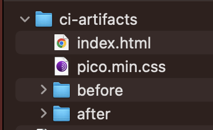

Double click on the "index.html". This will open the "Screenshots Diff Report" in your browser. It will show a before/after of all screens that have been changed. It will also display new screens that were added and display any that were removed (adding or removing screens would only result from core codebase changes OR if you're adding a brand new language for the first time).

It is up to you to review this diff report and visually inspect the impact your translation have had on the listed screens.

We expect that many translations will need adjusting. The point of the Screenshot Diff Report is so that you can quickly identify problem translations and immediately return to Transifex to revise them.

---

### Submitting revised translations to your existing PR
If a screenshot does reveal a problematic translation, make your translation edits in Transifex, then repeat the process of downloading the translation file.

Then at the top of your PR, click into your fork's branch:

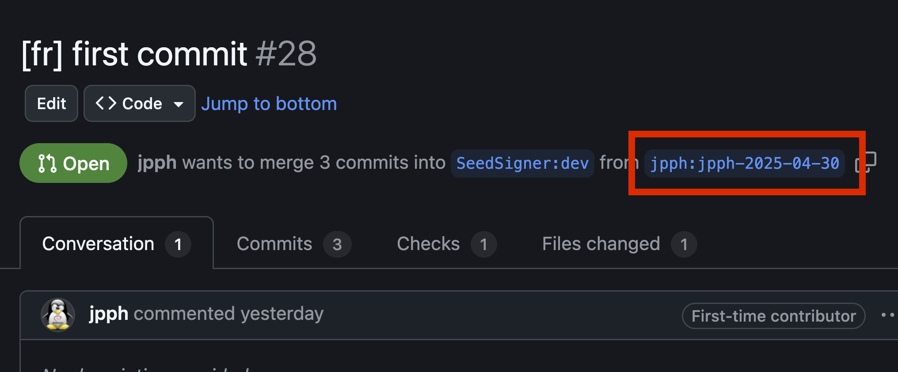

Then follow the same steps from "Upload your changes to your fork" above to navigate to the proper folder and then "Upload files". Once again, select your `messages.po` file.

The only difference this time through is that this will be treated as an additional commit on top of the one you did earlier. Once the updated file is committed, your PR will automatically include the latest changes.

At this point the automated system will re-run itself and generate a new Screenshot Diff Report for you to download and review.

Repeat this process as many times as necessary until you're satisified with all screens in the Screenshot Diff Report.

---

### What happens next?
Now that your PR is created, the project maintainers will review your PR and either merge your changes into the main translations repo or request changes.

Merged changes will then be included in the next SeedSigner release.